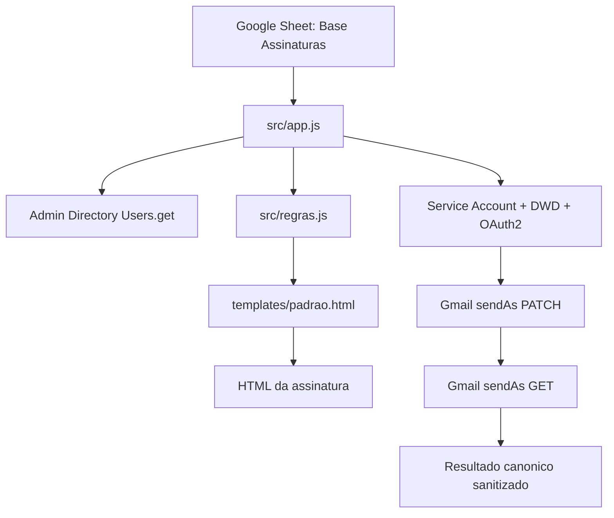
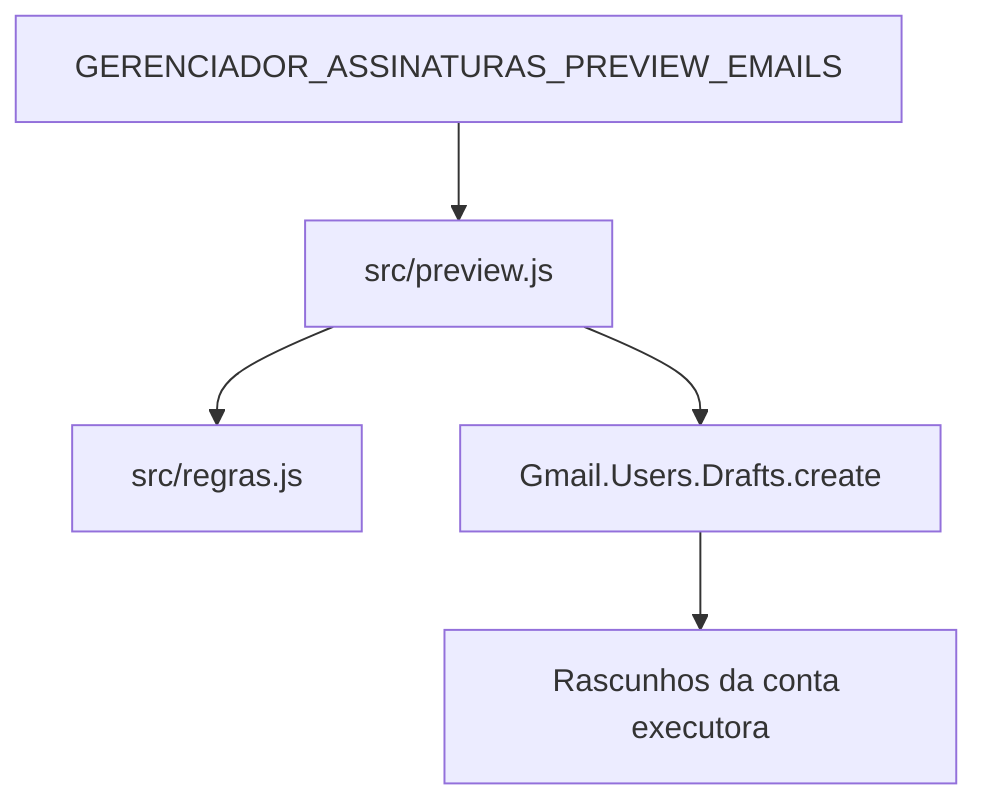

# Arquitetura

Este projeto foi organizado para separar orquestração, integrações Google, regras de negócio e apresentação HTML.

## Fluxo Principal

## Preview

O preview não usa Service Account nem OAuth delegado. Ele cria apenas rascunhos na conta executora para conferencia visual.

## Modulos

### src/app.js

Responsavel por:

- leitura da base;
- criação da lista de candidatos;
- fingerprint determinístico;
- checkpoint/resume;
- controle de lote e tempo;
- API pública;
- sanitização dos retornos logáveis.

### src/google.js

Responsável por:

- validação da Service Account;
- criação do serviço OAuth delegado;
- consulta ao Admin Directory;
- leitura da assinatura atual;
- PATCH da assinatura;
- GET pos-PATCH para confirmação canônica;
- retry 429/5xx;
- health check.

### src/preview.js

Responsável por:

- ler a lista de alvos de preview;
- validar limites;
- gerar HTML agregado somente com assinaturas validas;
- criar rascunhos com assunto simples.

### src/regras.js

Responsável por:

- normalização de textos;
- dicionários fictícios de cargos e unidades;
- regra Matriz/Unidade;
- montagem de dados finais da assinatura;
- proteção contra falso WhatsApp.

## Checkpoint

O checkpoint usa `GERENCIADOR_ASSINATURAS_CHECKPOINT_V1` durante a execução. Ele guarda progresso, acumulado e fingerprint da base.

O fingerprint considera:

- email;
- departamento da base;
- filial da base.

Os registros sao ordenados por email antes do digest para que mudanças de ordem na planilha não invalidem a retomada.

## Ciclo OAuth Delegado

Cada unidade lógica de atualização executa:

1. criar serviço OAuth delegado;
2. validar `hasAccess()`;
3. GET inicial;
4. PATCH;
5. GET pos-PATCH;
6. `reset()` em `finally`.

Esse padrão evita acumulo intencional de tokens por usuario em Script Properties.
